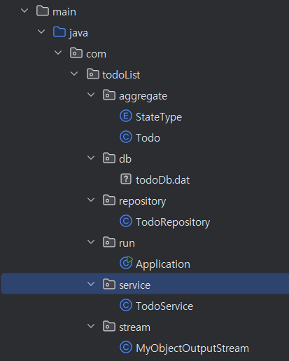
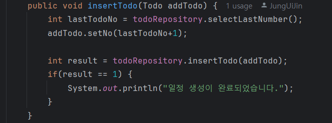
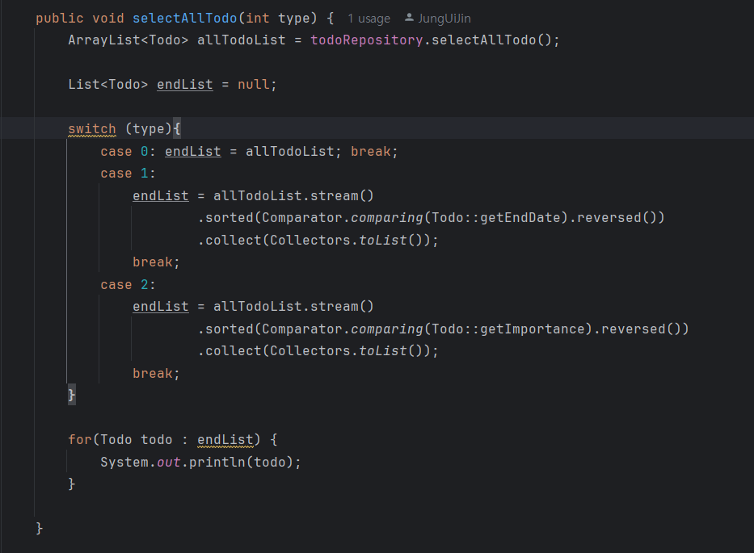
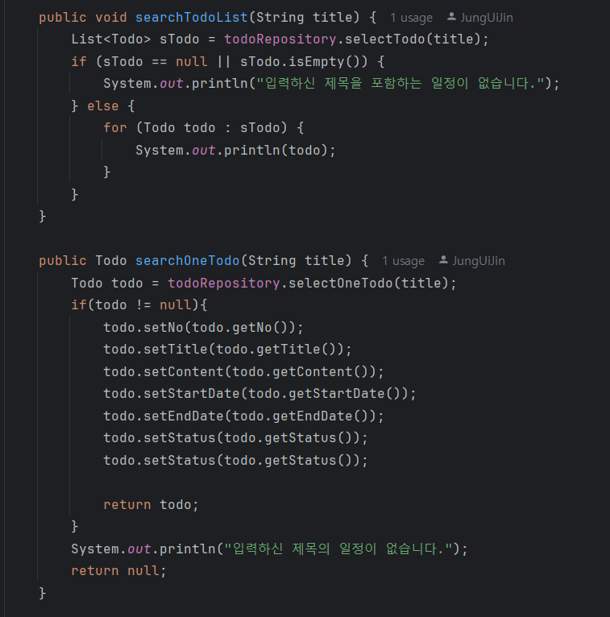
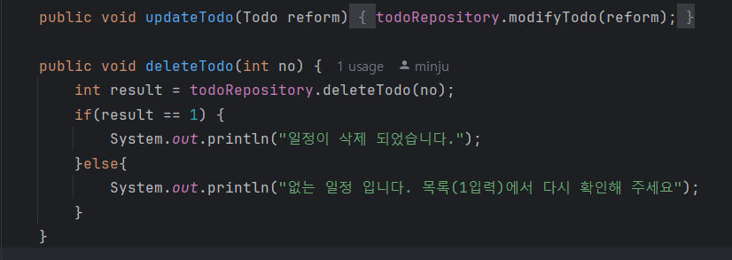
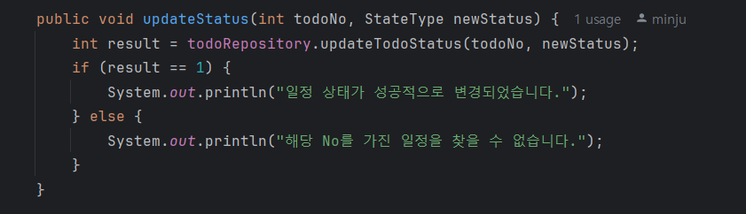

# 자바 프로젝트 : todo

팀원 : 김민주, 정의진

| |  |
|:-------------------------------------------------------------------------------------------:|:------------------------------------------------------------------------------------------:|
|                      김민주 [@minju0224](https://github.com/minju0224)                       |                                   정의진 [@JungUiJin](https://github.com/JungUiJin)                                   |
## 🧾기능설명

### 일정 관리 프로그램

## 🧑‍🤝‍🧑사용자 기능

1. 모든 일정 조회
    - 일정을 조건에 맞게 정렬할 수 있다
    -  (0 = 조건 없음, 1 = 마감일 순, 2 = 중요도 순)
2. 일정 검색
    - no를 통해 일정 검색 가능
3. 일정 추가
4. 일정 수정
    - 번호를 통해 일정을 수정
5. 일정 삭제
6. 일정 상태 관리
    - 진행전, 진행후, 완료로 상태를 변경 가능
9. 프로그램 종료

## 📁 디렉토리 구조

## 🧮주요코드

-  일정 추가

- 일정 정렬

- 일정 검색

- 일정 삭제

- 일정 상태 변경
